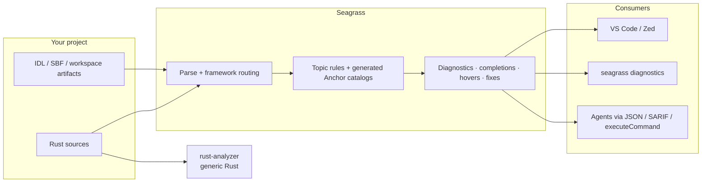

# Seagrass

> Anchor-aware diagnostics, quick fixes, and structured CLI output for Solana
> Rust programs — built for editors and AI agents.

[](LICENSE)
[](VERSION)
[](https://www.rust-lang.org/)
[](https://github.com/heyAyushh/seagrass/actions/workflows/pr.yaml)
[](docs/index.md)

**[Quickstart](#quickstart)** ·
**[Install](#install)** ·
**[CLI](#command-line-diagnostics)** ·
**[Editors](#editor-setup)** ·
**[Agents](#agents-and-automation)** ·
**[Lint catalog](docs/lints/README.md)** ·
**[Agent guide](docs/agents.md)** ·
**[Contributing](CONTRIBUTING.md)**

Seagrass is a standalone stdio language server **and** command-line linter for
Solana Rust programs. It understands `#[program]`, account structs, constraints,
PDAs, IDL/SBF artifacts, and a catalog of Solana security topics — the framework
layer that generic Rust tooling does not model. It complements rust-analyzer
rather than replacing it, and every diagnostic is also available as JSON or SARIF
so agents and CI can consume the same analysis an editor shows.

Current semantic coverage is **Anchor-first**. Pinocchio and native Solana
projects are detected for routing and shared Solana checks, but their
framework-specific constraint catalogs are still narrower than Anchor's.

> Unofficial — not affiliated with Coral or Anchor. Generated support targets
> the [`otter-sec/anchor`](https://github.com/otter-sec/anchor) line pinned in
> this workspace.

## Contents

- [What Seagrass catches](#what-seagrass-catches)
- [How it works](#how-it-works)
- [How it fits with rust-analyzer](#how-it-fits-with-rust-analyzer)
- [Quickstart](#quickstart)
- [Install](#install)
- [Command-line diagnostics](#command-line-diagnostics)
- [Editor setup](#editor-setup)
- [Agents and automation](#agents-and-automation)
- [Smoke test](#smoke-test)
- [Documentation](#documentation)
- [FAQ](#faq)
- [Contributing](#contributing)
- [License](#license)

## What Seagrass catches

Seagrass ships **41 documented diagnostic topics** across three families:

| Family | Examples |
| --- | --- |
| **Anchor** | Missing `payer`/`space` on `init`, account usage, PDA seeds, instruction attrs, IDL/SBF/keypair artifacts |
| **Security** | Owner checks, signer auth, type cosplay, CPI validation, sysvar addresses, token-account safety |
| **Solana quality** | Unchecked arithmetic, instruction-data bounds, bump canonicalization, stale accounts after CPI |

Take this deliberately incomplete accounts struct
([`fixtures/smoke-broken.rs`](fixtures/smoke-broken.rs)):

```rust
#[derive(Accounts)]
pub struct Create<'info> {
    #[account(init)]                  // ← no `payer`, no `space`
    pub state: Account<'info, State>,
    pub payer: Signer<'info>,
}
```

```sh
seagrass diagnostics fixtures/smoke-broken.rs --json
```

```jsonc
[
  {
    "range": { "start": { "line": 7, "character": 14 }, "end": { "line": 7, "character": 18 } },
    "code": "anchor-init-constraints",
    "severity": "ERROR",
    "topic": "seagrass/anchor.init.missing-payer",
    "confidence": "authoritative",
    "docsUrl": "https://github.com/heyAyushh/seagrass/blob/main/docs/lints/seagrass-anchor-init-missing-payer.md",
    "message": "Anchor `init` constraint is missing `payer = ...`; add the account that funds initialization."
  }
]
```

Each finding includes `file`, `applicability`, and a stable `seagrass/...` topic.
In an editor, the same issues appear as squiggles with quick fixes for missing
constraints.

[↑ Back to top](#seagrass)

## How it works



Parsed Rust and checked-in generated catalogs drive diagnostics — not string-only
heuristics. See [`docs/diagnostic-architecture.md`](docs/diagnostic-architecture.md)
for the region model and rule shape.

[↑ Back to top](#seagrass)

## How it fits with rust-analyzer

Run both. They own different layers.

| Layer | Tool | Owns |
| --- | --- | --- |
| Generic Rust | rust-analyzer | Types, borrow checking, non-framework refactors |
| Solana frameworks | Seagrass | Programs, accounts, constraints, artifacts, security topics |

- **Editors:** enable both on Rust; let Seagrass own framework squiggles and quick
  fixes. In Zed, set `diagnostics.transport: push` for live Problems.
- **Agents / CI:** use `seagrass diagnostics --json` or `--sarif`. Do not infer
  Anchor semantics from rust-analyzer output alone.

[↑ Back to top](#seagrass)

## Quickstart

| You are… | Do this | Verify |
| --- | --- | --- |
| **VS Code** | `cargo install --path crates/seagrass --locked`, load `editors/vscode` | Open `fixtures/smoke-broken.rs` — missing `payer` / `space` on `init` |
| **Zed** | Install binary + dev extension from `editors/zed` | Same fixture in Problems |
| **CI / shell** | `seagrass diagnostics <path> --json` or `--sarif` | `bash scripts/smoke-install.sh` |
| **Claude / Cursor / OpenCode** | Activate `editors/` templates + [`skills/`](skills/README.md) | Smoke script + `bun scripts/protocol-smoke.ts` |

```sh
bash scripts/smoke-install.sh
```

[↑ Back to top](#seagrass)

## Install

From this checkout (recommended today):

```sh
cargo install --path crates/seagrass --locked
seagrass --version   # expect 1.0.2
```

When a matching release is on [crates.io](https://crates.io/crates/seagrass-cli):

```sh
cargo install seagrass-cli --locked --version 1.0.2
```

Develop without installing:

```sh
cargo build -p seagrass-cli
cargo run -p seagrass-cli
```

[↑ Back to top](#seagrass)

## Command-line diagnostics

Headless path for agents, CI, and LSP bridges — JSON or SARIF on stdout, stable
exit codes (`0` clean · `1` has `ERROR` · `2` usage/input error).

```sh
# File or directory (recurses .rs)
seagrass diagnostics programs/ --json

# GitHub code scanning
seagrass diagnostics programs/ --sarif > seagrass.sarif

# Stdin with workspace path context
cat lib.rs | seagrass diagnostics --stdin --stdin-path programs/demo/src/lib.rs --json
```

From a checkout without installing, prefix with `cargo run -p seagrass-cli --`.

**GitHub Actions** — composite action
[`.github/actions/seagrass-diagnostics`](.github/actions/seagrass-diagnostics) or
copy [`docs/templates/seagrass-diagnostics-sarif.yml`](docs/templates/seagrass-diagnostics-sarif.yml).
Execute-command payloads: [`docs/agents.md`](docs/agents.md).

[↑ Back to top](#seagrass)

## Editor setup

### VS Code

```sh
cd editors/vscode && bun install && bun run check
cp editors/vscode/settings.recommended.json .vscode/settings.json   # when hacking this repo
```

Use **Run Seagrass Extension** for local testing. Settings live under `seagrass.*`;
set `seagrass.dev.useCargoFromCheckout` only while developing the server in-tree.

### Zed

```sh
rustup target add wasm32-wasip2
cd editors/zed
cargo build --target wasm32-wasip2 --release
cp ../../target/wasm32-wasip2/release/seagrass_zed.wasm extension.wasm
```

`zed: extensions` → **Install Dev Extension** → `editors/zed`.

```json
{
  "lsp": {
    "seagrass": {
      "binary": {
        "path": "cargo",
        "arguments": ["run", "-p", "seagrass-cli", "--quiet"]
      },
      "settings": {
        "diagnostics.transport": "push",
        "diagnostics.security.ownerChecks": "warn",
        "workspaceIndex.enabled": true
      }
    }
  },
  "languages": {
    "Rust": { "language_servers": ["seagrass", "!rust-analyzer", "..."] }
  }
}
```

Full settings and logging: [`editors/zed/README.md`](editors/zed/README.md) ·
shared UI contract: [`editors/UI_CONTRACT.md`](editors/UI_CONTRACT.md).

[↑ Back to top](#seagrass)

## Agents and automation

"Headless" means no editor UI — stdio LSP, JSON/SARIF, and
`workspace/executeCommand`. Not a separate product mode.

| Tool | Activation |
| --- | --- |
| **Claude Code** | `ln -sfn "$(pwd)/skills/seagrass-*" ~/.claude/skills/` — see [`skills/README.md`](skills/README.md) |
| **OpenCode** | `ln -sfn editors/opencode/opencode.json opencode.json` |
| **Cursor** | `ln -sfn ../../editors/cursor/rules/seagrass.mdc .cursor/rules/seagrass.mdc` |
| **Codex / Aider / bridges** | `{ "command": "cargo", "args": ["run", "-p", "seagrass-cli", "--quiet"] }` + [`docs/agents.md`](docs/agents.md) |

Repository rules for coding agents: [`AGENTS.md`](AGENTS.md).

Sanity-check integrations:

```sh
bun scripts/protocol-smoke.ts
```

[↑ Back to top](#seagrass)

## Smoke test

1. Open [`fixtures/smoke-broken.rs`](fixtures/smoke-broken.rs) — expect init
   companion errors (`payer`, `space`).
2. Run `bash scripts/smoke-install.sh`.
3. In an editor: completions inside `#[account(...)]`, hover on `init`, quick fix
   for `payer` / `space`.

[↑ Back to top](#seagrass)

## Documentation

| Resource | Where |
| --- | --- |
| Docs home | [`docs/index.md`](docs/index.md) |
| Agent / SARIF / executeCommand | [`docs/agents.md`](docs/agents.md) |
| Lint topics + suppressions | [`docs/lints/README.md`](docs/lints/README.md) |
| HTML lint index | [`docs/lints/index.html`](docs/lints/index.html) — `bun scripts/build-lint-docs-index.ts` |
| Architecture | [`docs/diagnostic-architecture.md`](docs/diagnostic-architecture.md) |
| Release proof | [`docs/quality-kit.md`](docs/quality-kit.md) |

Build the searchable site:

```sh
mkdocs build --strict
```

[↑ Back to top](#seagrass)

## FAQ

**Do I need rust-analyzer?**
Yes, for generic Rust. Seagrass does not replace type checking or borrow checking.

**Can I use Seagrass without an editor?**
Yes. `seagrass diagnostics` is the supported agent/CI surface; JSON is default,
SARIF is for GitHub code scanning.

**Why are some Pinocchio/native findings weaker than Anchor?**
Framework routing exists for all three, but generated constraint catalogs and
editor parity are deepest on Anchor today.

**How do I suppress a finding?**
Use the narrowest `seagrass-ignore` / `seagrass-allow` form for the topic — see
the matching page under [`docs/lints/`](docs/lints/) or the
[`seagrass-suppress`](skills/seagrass-suppress/SKILL.md) skill.

**How do I report a false positive?**
Follow [`seagrass-debug-fp`](skills/seagrass-debug-fp/SKILL.md) or VS Code
**Seagrass: Report False Positive** when using the extension.

**Where do topic counts come from?**
The machine-readable catalog is [`docs/topics.json`](docs/topics.json) (41 topics);
each topic has a Markdown page under `docs/lints/`.

[↑ Back to top](#seagrass)

## Contributing

Maintainer workflows: [`CONTRIBUTING.md`](CONTRIBUTING.md) · catalog regeneration:
[`SUPPORT_GENERATOR.md`](SUPPORT_GENERATOR.md).

```sh
cargo test -p seagrass
bun scripts/verify-production.ts
```

[↑ Back to top](#seagrass)

## License

The Seagrass LSP overlay and local editor adapters are [MIT](LICENSE). Generated
Anchor-derived catalogs are attributed in [`NOTICE`](NOTICE) (Apache-2.0 upstream).
The parent Anchor workspace keeps its own license unless a file states otherwise.