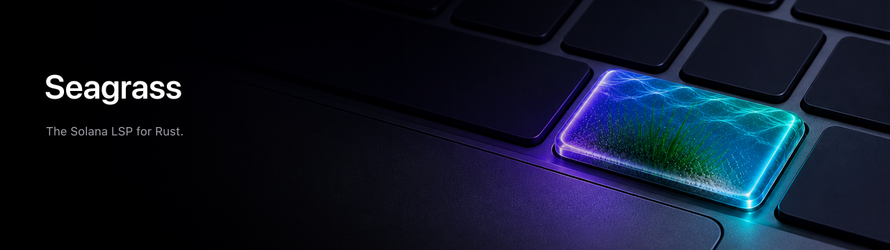

# Seagrass

Codebase intelligence for Solana programs: Seagrass is rust-analyzer for
Solana. It reads your program the way the runtime does — accounts,
constraints, CPIs, PDAs, deploy artifacts — and tells you what's wrong before
mainnet does. Use it in your editor, on the command line, or in CI.

Generic Rust tooling can't see Solana's failure modes: an `init` with no payer, an account you forgot to check the owner on, a PDA seeded with attacker-controlled input. Seagrass is built to catch exactly those.

## See it work

Here's an incomplete Anchor account struct — it compiles, but it won't run:

```rust
#[derive(Accounts)]
pub struct Create<'info> {
    #[account(init)]
    pub state: Account<'info, State>,
    pub payer: Signer<'info>,
}
```

```bash
$ seagrass diagnostics create.rs --json
```

Seagrass finds two problems, points at the exact line, and tells you how to fix each:

```
ERROR  anchor.init.missing-payer   line 3
  `init` is missing `payer = ...`; add the account that funds initialization.

ERROR  anchor.constraint.shape     line 3
  `state` uses `init` but `Create` has no `Program<'info, System>` field
  named `system_program`.
```

The full JSON carries the byte range, a `docsUrl` for each rule, severity, and a `confidence` level — everything an editor or an agent needs to act. Exit code is `1` when any ERROR is found, `0` when clean, `2` on bad input.

## Install

Needs Rust 1.89+ (pinned in `rust-toolchain.toml`).

```bash
cargo install --git https://github.com/heyAyushh/seagrass seagrass-cli --locked
```

That gives you a `seagrass` binary. Point it at a file or a directory:

```bash
seagrass diagnostics programs/ --json          # all diagnostics, machine-readable
seagrass diagnostics programs/ --sarif > s.sarif   # for GitHub code scanning
seagrass analyze programs/ --json              # structure: accounts, instructions, CPIs, PDAs
cat lib.rs | seagrass diagnostics --stdin --stdin-path lib.rs --json
```

Run `seagrass` with **no arguments** and it speaks LSP over stdio — that's how the editors below talk to it.

Using an AI agent? Point it at [`skills/seagrass-install/SKILL.md`](skills/seagrass-install/SKILL.md) to install and wire up Seagrass for your editor.

## What it catches

Four families, each linking to a per-rule doc with examples and false-positive boundaries — browse the full set in [`docs/lints/`](docs/lints/):

- **Anchor constraints** — `init` missing payer/space/seeds/bump, malformed constraint expressions, unused `Context<T>` accounts, SPL token-vs-mint mismatches.
- **Security** (every framework) — unchecked owners and signers, unverified CPI program IDs, static PDA seeds and seed collisions, needless `mut`, type cosplay.
- **Code quality** — lamport loss on close, double-init, unchecked arithmetic, deserialization overflows, accounts read stale after a CPI.
- **Artifact freshness** — IDL drift, deploy keypair vs declared program ID, generated types out of sync, static SBF compute floors from the `.text` section.

## What it won't do

Seagrass only claims what its evidence supports, and it tells you which layer a
finding came from. Runtime intelligence is an evidence-ingestion boundary:

- **Static** — from your source, manifests, IDLs, and SBF binaries. Always on.
- **Preflight** — validates Anchor runtime errors (data length, account count/owner, init status, discriminator, realloc) from explicit invocation JSON, e.g. a tx simulation. No validator required. Try it: `seagrass preflight fixtures/preflight/anchor-errors.json --json`.
- **Runtime** — real compute usage, traffic, live account state. These stay `unavailable` unless you feed in telemetry. Seagrass will **not** invent them from code shape.

Details in [`docs/product-framing.md`](docs/product-framing.md).

## In your editor

Seagrass runs next to rust-analyzer — rust-analyzer keeps doing generic Rust, Seagrass adds the Anchor/Solana layer (constraint-aware completion, quick fixes, hovers, account/CPI navigation).

- **VS Code** — local dev extension (not on the Marketplace yet): `cd editors/vscode && bun install && bun run check && code .`, then run **Run Seagrass Extension**. → [`editors/vscode/README.md`](editors/vscode/README.md)
- **Zed** — `zed: extensions` → **Install Dev Extension** → pick `editors/zed`. It finds `seagrass` on your `PATH` (or builds it), pushes diagnostics live. → [`editors/zed/README.md`](editors/zed/README.md)
- **Anything else** — command `seagrass`, language `rust`, root markers `Anchor.toml` / `Cargo.toml`.

## For agents

Seagrass is built to be an agent's source of truth for Anchor/Solana code —
drop-in prompts and the LSP command payloads (`instructionSummary`,
`programReport`, `proposeAssists`) are in [`docs/agents.md`](docs/agents.md),
or pull version-matched instructions from the installed binary:

```bash
seagrass skills list --json
seagrass skills get audit --full
```

The installed-CLI discovery contract is documented in
[`docs/agent-skill-help.md`](docs/agent-skill-help.md).

In CI, install the same way and upload SARIF:

```yaml
- run: cargo install --git https://github.com/heyAyushh/seagrass seagrass-cli --locked
- run: seagrass diagnostics programs/ --sarif > seagrass.sarif
- uses: github/codeql-action/upload-sarif@v3
  if: always()
  with:
    sarif_file: seagrass.sarif
```

Bundled agent skills (Claude Code, Cursor, OpenCode) live in `skills/` — symlink them into `~/.claude/skills` and see [`docs/agents.md`](docs/agents.md).

## Framework support

Anchor v1/v2 gets the deep treatment: constraints, init safety, completions, IDL checks. Native Solana and Pinocchio get the same security and artifact coverage wherever the semantics line up (owner/type/signer/CPI/PDA), just without Anchor-specific syntax. The exact matrix and its enforcement tests are in [`docs/framework-parity.md`](docs/framework-parity.md).

## Develop

```bash
rustup toolchain install 1.89.0 --profile minimal --component clippy rustfmt
cargo test -p seagrass                 # core
bun scripts/verify-production.ts       # full gate: LSP, editors, versions, hygiene
```

[`CONTRIBUTING.md`](CONTRIBUTING.md) has the full workflow and quality gates. If you're driving an AI agent to work on Seagrass itself, [`AGENTS.md`](AGENTS.md) is its guide to this repo.

## License

MIT — see [`LICENSE`](LICENSE). Seagrass is an unofficial fork based on [`otter-sec/anchor`](https://github.com/otter-sec/anchor); [`NOTICE`](NOTICE) carries the Apache-2.0 attribution for the generated Anchor support catalogs.


